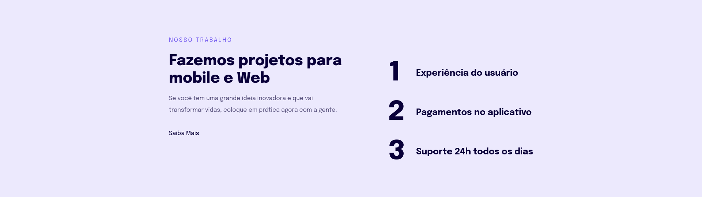
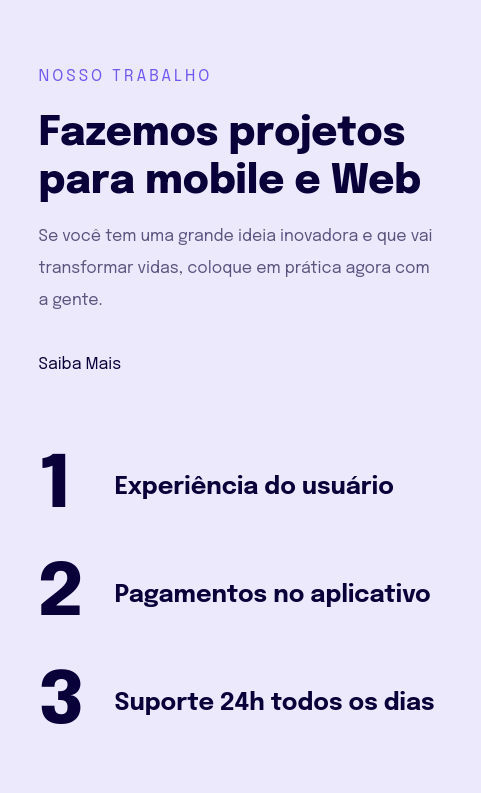

# Projeto 02 - Stage 03, Explorer.

Este é o segundo projeto do Stage 03 do programa Explorer da [RocketSeat](rocketseat.com.br/).

## Índice

- [Projeto](#NossoTrabalho_Responsive)
  - [Screenshots](#screenshots)
  - [Tecnologias Utilizadas](#tecs)
  - [Autor](#autor)

## NossoTrabalho_Responsive

Este projeto é o resultado do conhecimento adquirido no primeiro contato com a responsividade durante o Explorer.  

### Páginas

Projeto Git - [Projeto](https://loreancarlos.github.io/NossoTrabalho_Responsive/)

### O Desafio

- Recriar o layout completo de uma página.
    - Adicionar todos os elementos do projeto mantendo suas proporções e características.
    - Utilizar tags semânticas para melhor acessibilidade.
    - Modelar o layout de forma responsiva para se adequar a todos os tamanhos de dispositivos. 
- Obs: As especificações do layout foram disponibilizadas pelo Figma.

### Screenshots

## Tecs

Tecnologias

- HTML
- CSS

Outras

- HTML5 - Tags Semânticas
- CSS - Display Flexbox - @Media Queries

## Autor

- LinkedIn - [Lorean Carlos](https://www.linkedin.com/in/lorean-carlos-fernandes-soares-03220121a/)
- Rocketseat - [Perfil](https://app.rocketseat.com.br/me/loreancarlos)